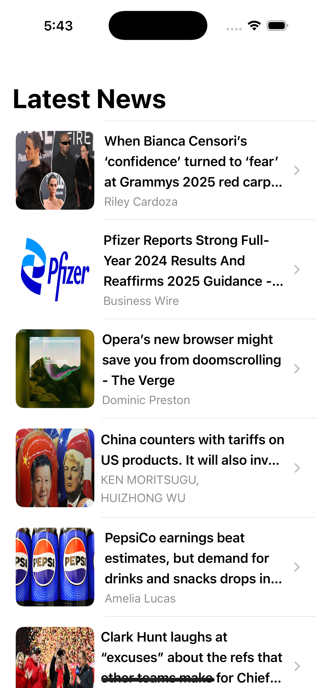

<h1>NewsApp</h1>

A SwiftUI-based news application that fetches and displays the latest news articles. Users can view article details, including engagement metrics such as likes and comments.

<h2>Features</h2>
<ul>
    <li>Fetches and displays top news headlines.</li>
    <li>Uses Kingfisher for efficient image loading and caching.</li>
    <li>Supports navigation to article details.</li>
    <li>Displays engagement metrics (likes & comments) for each article.</li>
    <li>Uses MVVM architecture for clean code separation.</li>
    <li>Implements mock services for testing.</li>
</ul>

<h2>Architecture</h2>

This project follows the MVVM (Model-View-ViewModel) architecture:

<ul>
    <li><b>Model:</b> Represents the news data (<code>NewsModel</code>, <code>ArticlesResponse</code>).</li>
    <li><b>View:</b> SwiftUI views (<code>ContentView</code>, <code>NewsCard</code>, <code>NewsDetailView</code>).</li>
    <li><b>ViewModel:</b> Business logic for fetching and storing data (<code>NewsViewModel</code>, <code>NewsDetailViewModel</code>).</li>
    <li><b>Service Layer:</b> Handles API calls (<code>NewsService</code>, <code>NewsDetailService</code>).</li>
</ul>

<h2>Dependencies</h2>

The project uses the following libraries:

<ul>
    <li><b>Kingfisher:</b> for image caching & loading.</li>
    <li><b>SwiftUI:</b> for UI development.</li>
</ul>

<h2>Installation</h2>

<h3>Clone the repository:</h3>
<pre><code>git clone https://github.com/your-repo/news-app.git
cd news-app</code></pre>

<h3>Open the project in Xcode:</h3>
<pre><code>open NewsApp.xcodeproj</code></pre>

<h3>Run the project using:</h3>
<pre><code>⌘ + R</code> in Xcode.</pre>

<h2>API Configuration</h2>

This project uses the NewsAPI for fetching news articles.

<ol>
    <li>Get your API key from <a href="https://newsapi.org/">NewsAPI</a>.</li>
    <li>Open <code>API.swift</code> and replace:</li>
</ol>

<pre><code>struct API {
    static let key = "YOUR_NEWS_API_KEY"
}</code></pre>

<h2>Testing</h2>

The project includes unit tests for the ViewModels using mock services.

<ul>
    <li><b>Test Cases:</b> <code>NewsViewModelTests.swift</code>, <code>NewsDetailViewModelTests.swift</code>.</li>
</ul>

<h3>Run tests using:</h3>

<b>Xcode:</b> <code>⌘ + U</code>

<h3>Terminal:</h3>
<pre><code>xcodebuild test -scheme NewsApp -destination 'platform=iOS Simulator,name=iPhone 15'</code></pre>

<h2>Screenshots</h2>

<b>Home Screen</b>

<b>Article Details</b>

<h2>Future Improvements</h2>
<ul>
    <li>Implement pull-to-refresh for news updates.</li>
    <li>Add bookmarking feature to save favorite articles.</li>
    <li>Improve error handling and add UI alerts.</li>
</ul>

<h2>Contributing</h2>
<ol>
    <li>Fork the repository.</li>
    <li>Create a new branch:</li>
</ol>

<pre><code>git checkout -b feature-name</code></pre>

<ol start="3">
    <li>Commit your changes:</li>
</ol>

<pre><code>git commit -m "Add new feature"</code></pre>

<ol start="4">
    <li>Push the branch:</li>
</ol>

<pre><code>git push origin feature-name</code></pre>

<ol start="5">
    <li>Open a Pull Request on GitHub.</li>
</ol>

<h2>License</h2>

This project is open-source and available under the MIT License.

